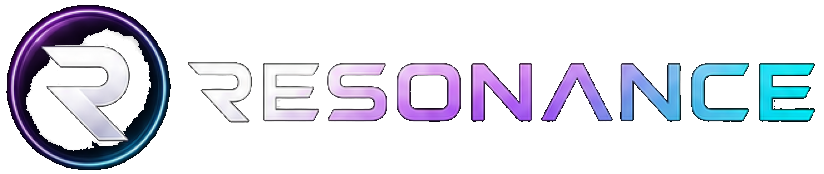
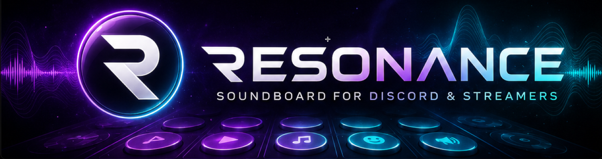

# Resonance

<p align="center">
  
</p>

<p align="center">
  <strong>Soundboard desktop moderne pour Windows.</strong><br>
  Tauri · React · Rust · WASAPI · Discord Rich Presence
</p>

<p align="center">
  <a href="#t%C3%A9l%C3%A9chargement">Télécharger</a> ·
  <a href="#fonctionnalit%C3%A9s">Fonctionnalités</a> ·
  <a href="#compilation">Compiler</a> ·
  <a href="#roadmap">Roadmap</a> ·
  <a href="#license">License</a>
</p>

---

## Qu’est-ce que Resonance ?

Resonance est une soundboard Windows conçue pour les streamers, créateurs de contenu et joueurs qui veulent envoyer des sons propres sur Discord, OBS, ou n’importe quel logiciel audio.

Elle repose sur un **moteur audio Rust/WASAPI** et une interface **React/Tailwind** sombre et réactive.



## Fonctionnalités

- 🎭 **Board unique** avec pads circulaires, emojis et images personnalisées.
- 🔊 **Routing audio avancé** : sortie soundboard (Discord/Live) + monitoring personnel (casque).
- 🎧 **Monitoring local** : entendre les sons sur ton casque en même temps.
- 🎙️ **Auto ducking** : baisse temporairement le micro quand un son joue.
- ⌨️ **Hotkeys globaux** : déclenche les sons depuis n’importe quelle application.
- 📚 **Bibliothèque** : gestion des sons, catégories, favoris, volumes individuels.
- 💬 **Discord Rich Presence** : affiche “Joue : [son]” sur ton profil.
- 🎨 **Thèmes** : Obsidian, Cyberpunk, Midnight Blue, Soft Purple.
- ⚡ **Performance native** : binaire compilé, pas d’Electron.

## Téléchargement

Rends-toi sur la page [Releases](https://github.com/TON_PSEUDO_GITHUB/resonance/releases) et télécharge le dernier installateur Windows :

- `Resonance_x64-setup.exe` (installateur NSIS)
- `Resonance_x64.msi` (installateur MSI)

> VB-CABLE est recommandé pour router le son vers Discord. L’installateur te guidera.

## Prérequis

- Windows 10 ou 11 (64 bits)
- [VB-CABLE Virtual Audio Device](https://vb-audio.com/Cable/) (recommandé)
- Un compte Discord (optionnel, pour la Rich Presence)

## Compilation

```bash
# 1. Cloner le repo
git clone https://github.com/TON_PSEUDO_GITHUB/resonance.git
cd resonance

# 2. Installer les dépendances
npm install

# 3. Configurer la Rich Presence Discord (optionnel)
# Édite src-tauri/src/discord_rpc.rs et remplace [REDACTED] par ton Application ID.

# 4. Builder le setup Windows
npm run tauri:build:win
```

Les installateurs se trouvent dans :

```
src-tauri/target/release/bundle/nsis/
src-tauri/target/release/bundle/msi/
```

## Roadmap

- [ ] Glow actif persistant sur les pads.
- [ ] Sélecteur d’émoji inline amélioré.
- [ ] Transitions animées entre les routes.
- [ ] Plus de thèmes prédéfinis.
- [ ] Pack de sons intégrés.
- [ ] Synchronisation cloud des sons (optionnel).

## Contribuer

Les issues et pull requests sont les bienvenues !

Consulte [CONTRIBUTING.md](./CONTRIBUTING.md) (à venir) pour les conventions.

## Support

Si tu aimes Resonance, tu peux soutenir le projet :

- ⭐ Donner une étoile au repo.
- ☕ [Offrir un café]()
- 🐞 [Signaler un bug](https://github.com/TON_PSEUDO_GITHUB/resonance/issues)

## License

Distribué sous licence MIT. Voir [LICENSE](./LICENSE).

## Remerciements

- [Tauri](https://tauri.app/)
- [VB-Audio](https://vb-audio.com/)
- [Lucide Icons](https://lucide.dev/)
- [Tailwind CSS](https://tailwindcss.com/)
